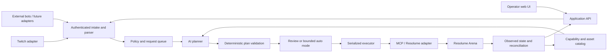

# Architecture proposal

No implementation stack is selected. A TypeScript backend and React UI are a candidate for shared request schemas; evaluate model/MCP SDK support and packaging before committing.

## Responsibilities

- **Chat adapters:** platform authorization, verified event ingestion, normalization, reconnects, and deduplication. They cannot grant themselves operator privileges.
- **Application service:** owns queue, policy, authentication, show profiles, request history, and operator controls. The UI and external bots use this service.
- **Planner:** converts prompt plus discovered capabilities into a structured plan. MVP support for local Laya and hosted Jev by TypeSafe AI is confirmed. A shared decision interface is proposed; supported decisions, latency, privacy, and cost require evaluation.
- **Validator/executor:** enforces target IDs, allowed operations, ranges, plan age, action count, and policy independently of model output. All mutation paths share this gate.
- **MCP boundary:** narrow tools for catalog/state reads, plan preview, and validated execution. Do not expose unrestricted vendor tools to audience-driven planning.
- **Arena adapter:** maps validated actions to verified transport capabilities and reconciles the result with observed state.

## Official MCP reuse — confirmed direction, integration research pending

Resolume supplies an official MCP server in Arena 7.26+. Reuse it where possible as an upstream connection behind the same policy gate. Compare it with a Rezzoloom MCP facade backed by REST/WebSocket. Decide whether a custom server adds necessary bounded operations, batching, state checks, or portability; do not rebuild the entire vendor API by default.

An official-server integration would make Rezzoloom an MCP client. A custom facade would also make Rezzoloom an MCP server. This distinction must be settled before selecting SDKs or promising external AI-client support.

## Deployment proposal

The service must connect to existing Arena installations locally, over LAN, or remotely. It is not restricted to running beside Arena. Both lightweight local and community installation profiles are required; see [gallery and install design](GALLERY_AND_INSTALLS.md). A small Arena-side connector is proposed for local MCP access and output capture, with authenticated encrypted remote transport. The transport and pairing mechanism remain undecided. On 2026-10-04 the user reported a working local Arena instance on Linux, available for low-performance functional tests. Its version, runtime and capabilities are not yet inspected; do not assume native Linux vendor support. Windows/macOS validation remains required.

Prefer REST for discovery/commands and WebSocket for state tracking where supported. OSC is an optional capability-specific fallback, pending evidence of a gap. Never infer support from a protocol name alone.

## State and consistency

Use stable resource identifiers where the tested API supports them. Include composition identity and a local state revision in each plan. Revalidate before writes, invalidate plans on relevant manual changes, and serialize writes. A local snapshot is a recovery aid, not a claim of transactional rollback. Handle partial application explicitly; do not blindly retry non-idempotent triggers after a timeout.

Proposed local storage: lightweight database for profiles, catalog annotations, request states, and audit events; secrets in an OS credential store or restricted configuration. Final storage and packaging remain open.

## Video feed boundary

The control path manipulates Arena state; video output stays in Arena's existing output/streaming setup. Clip thumbnails are not a live program monitor. Short animated gallery captures are required and need an explicit capture/encoding integration. A continuous live monitor remains a separate optional feature. Neither capture nor native composition export is assumed to be available through MCP.

## Gallery and event subsystems — proposal

Separate score events and payment/identity verification from creative planning. A deterministic scheduler applies [queue policy](QUEUE_POLICY.md). Gallery metadata, capture jobs, downloads, remix ancestry, and versioned [training archives](TRAINING_ARCHIVE.md) share the core in both install profiles; community adds authentication and social actions. Preserve a small local installation without mandatory distributed services.
