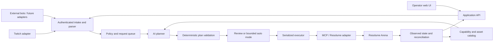

# Architecture proposal

No implementation stack is selected. A TypeScript backend and React UI are a candidate for shared request schemas; evaluate model/MCP SDK support and packaging before committing.

## Responsibilities

- **Chat adapters:** platform authorization, verified event ingestion, normalization, reconnects, and deduplication. They cannot grant themselves operator privileges.
- **Application service:** owns queue, policy, authentication, show profiles, request history, and operator controls. The UI and external bots use this service.
- **Planner:** converts prompt plus discovered capabilities into a structured plan. Provider is replaceable; tool support, latency, privacy, and cost require evaluation.
- **Validator/executor:** enforces target IDs, allowed operations, ranges, plan age, action count, and policy independently of model output. All mutation paths share this gate.
- **MCP boundary:** narrow tools for catalog/state reads, plan preview, and validated execution. Do not expose unrestricted vendor tools to audience-driven planning.
- **Arena adapter:** maps validated actions to verified transport capabilities and reconciles the result with observed state.

## Reuse versus custom MCP — research gate

Resolume supplies an official MCP server in Arena 7.26+. First evaluate it as an upstream connection behind the same policy gate. Compare it with a Rezzoloom MCP facade backed by REST/WebSocket. Decide whether a custom server adds necessary bounded operations, batching, state checks, or portability; do not rebuild the entire vendor API by default.

An official-server integration would make Rezzoloom an MCP client. A custom facade would also make Rezzoloom an MCP server. This distinction must be settled before selecting SDKs or promising external AI-client support.

## Deployment proposal

Run the service beside Arena for the simplest first install, with a browser UI. A separate trusted LAN host is an option, but needs an explicit authentication and network plan. A Linux development checkout does not establish that Arena runs on Linux; validate the actual Windows/macOS show machine and supported Arena version.

Prefer REST for discovery/commands and WebSocket for state tracking where supported. OSC is an optional capability-specific fallback, pending evidence of a gap. Never infer support from a protocol name alone.

## State and consistency

Use stable resource identifiers where the tested API supports them. Include composition identity and a local state revision in each plan. Revalidate before writes, invalidate plans on relevant manual changes, and serialize writes. A local snapshot is a recovery aid, not a claim of transactional rollback. Handle partial application explicitly; do not blindly retry non-idempotent triggers after a timeout.

Proposed local storage: lightweight database for profiles, catalog annotations, request states, and audit events; secrets in an OS credential store or restricted configuration. Final storage and packaging remain open.

## Video feed boundary

The control path manipulates Arena state; video output stays in Arena's existing output/streaming setup. Clip thumbnails are not a live program monitor. Live preview transport, bandwidth, and capture integration are a separate investigation and are not an MVP dependency.
